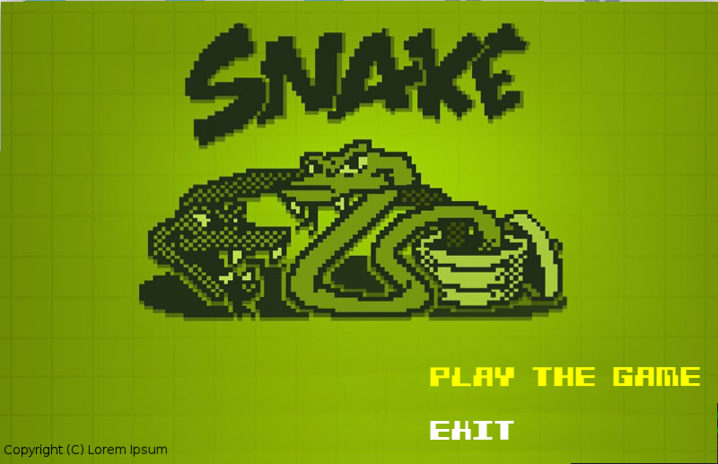
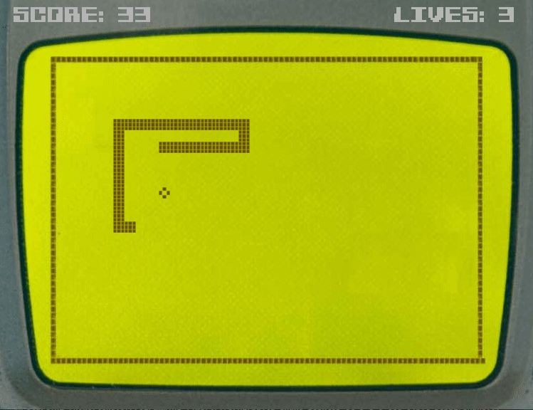

# Classic Snake in SFML

Remember those golden days when there was no internet and the only source of entertainment was the television. Back when Television had games in them and one of them was snake. You'd control the snake with the arrow keys on your TV remote and remember that frustrating moment when you know you pressed the button still you lose! This is what I call *classic* snake. While there are thousands of snake clones floating over, yet only few of them gives you that 'retro' feel, like you are playing on your television. So I decided to create this little snake game.

**NOTE**: This is a snake game written in SFML when I was a beginner in SFML (i still am - lol), and so some practices might not be professional (please make an issue if that is the case)
Anyways here's how it looks like:-
<br>
<p align="center">


</p>
<br>

You control the snake with W,A,S,D keys (because controling with the arrow keys suck)

# How to build?

Provided you are not on a Windows (nothing would suck more than that), you execute the following command

```bash
  make
  ./snake
```

And that's it!! Ofcourse you need to install SFML if you don't already have it.

## Legal Business

I found these images on internet thanks to Google. Now don't ask me which company is behind it? who is the artist? Cause I don't know that myself. It's painful but true. If these assets belong to you and you don't want them to be here then contact me and get them removed from here
